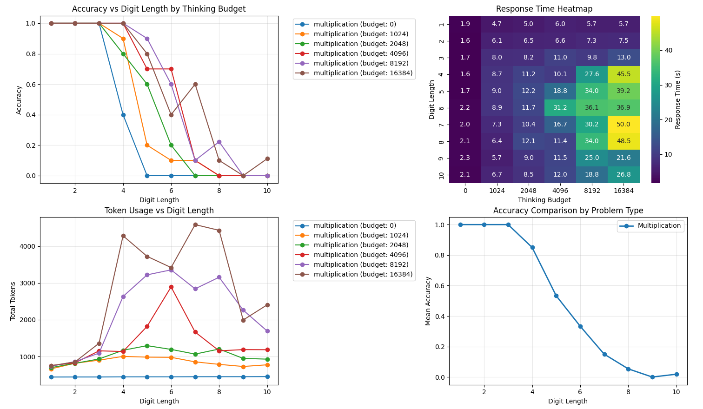

**TLDR**: "Reasoning" LLMs cannot actually apply algorithms to arbitrary lengths of data through chain of thought, even when they should have enough tokens to do so; rather, they likely rely on a set of heuristics which breakdown on high difficulty or long length problems. Moreover, these models even appear to "give up" past a certain difficulty and emit less thinking tokens than on easier problems of the same type! A recent paper from Apple showed this behavior; here, we replicate the results using simple n-digit multiplication.

# The Illusion of Thinking

The recent paper ["The Illusion of Thinking: Understanding the Strengths and Limitations of Reasoning Models via the Lens of Problem Complexity"](https://machinelearning.apple.com/research/illusion-of-thinking) show that "LRMs have limitations in exact computation: they fail to use explicit algorithms and reason inconsistently across puzzles" and call into question the ability of Reasoning LLMs, a.k.a Large Reasoning Models (LRMs), to actually think, particularly in the algorithmic sense. The paper also makes an interesting discovery: reasoning effort increases with problem complexity up to a certain point, then decreases, despite adequate budget.

I replicated some of the results of the paper on simple multiplication problems, by varying the digit length (n x n) of the problem and the allowed thinking budget for Claude 3.7 Sonnet. The experiment itself is dead simple but the results corroborate much of the paper's findings. The results are shown in the figure below.

From the results, we see a few things. First, we can see that accuracy falls off abruptly as digit length increases and that increasing the thinking budget tends to right-shift the curve -- but the curve's shape tends to stay more or less the same. In the bottom left graph we can see the "giving up" behavior where tokens used initially increases, but eventually steeply falls off past a certain point. This is more pronounced for the larger thinking budgets (although budget=4096 shows this the best). Since we can only increase the digit length by integer amounts, the curves aren't perfectly smooth, and the highest thinking budget tested (16834) does show some deviation from this behavior, although the overall shape is still similar. Likewise, the response time graph in the top right closely mirrors the token usage, as to be expected (since more tokens used means more response time).

Something interesting to point out though is that none of the thinking budgets actually saturate the full thinking budget (outside of no thinking I suppose). For example, budget 4096 only expends up to around 3000 tokens before "giving up". However, we can still see performance increases when upping the budget to 8192 _despite_ the fact that the 8192 budget also does not exceed the previous 4096 budget! **This implies that allowing the model additional thinking budget can result in better performance _even when it does not use the additional budget_**. Given that we don't know the inner workings of how Claude limits its thinking budget, it's hard to know how this mechanism works, but perhaps it is similar to [this recent paper](https://arxiv.org/abs/2506.13752). 

Code for the project is [here](https://github.com/ndalton12/llm-arithmetic). If you have the budget, feel free to fork and test with different models -- the code is using LiteLLM so it should be easy to try different ones (although you may need to change the thinking parameter). 

# The Obviously Jagged Frontier
How can models which are pushing better and better results in mathematics competitions fail to do simple arithmetic? The idea that LLMs are incredibly smart at some things but relatively stupid at other things is known as the jagged frontier -- that is, LLMs push well above average humans on some tasks and well below at others, hence creating a jagged boundary of intelligence. 

It's not yet clear why LLMs behave this way, but we can speculate about their nature from the results of "The Illusion of Thinking" and the results shown here. From ["Circuit Tracing"](https://transformer-circuits.pub/2025/attribution-graphs/methods.html) we can see that Claude likely does addition through "several intermediate heuristics rather than a coherent procedural program with a single confident output." It's reasonable to assume that other arithmetic operations behave similarly (such as multiplication). By relying on heuristics, the models build uncertainty with each step, and perhaps recognize or are overwhelmed when needing to apply these heuristics across increasingly more digits in arithmetic problems. Or perhaps the _width_ of the network limits its ability to produce coherent heuristics across larger digit inputs when applying complex, heuristic driven attention patterns.

That said, I think there are many open questions in this area. If you want to discuss, feel free to contact me at niall.dalton12@gmail.com.