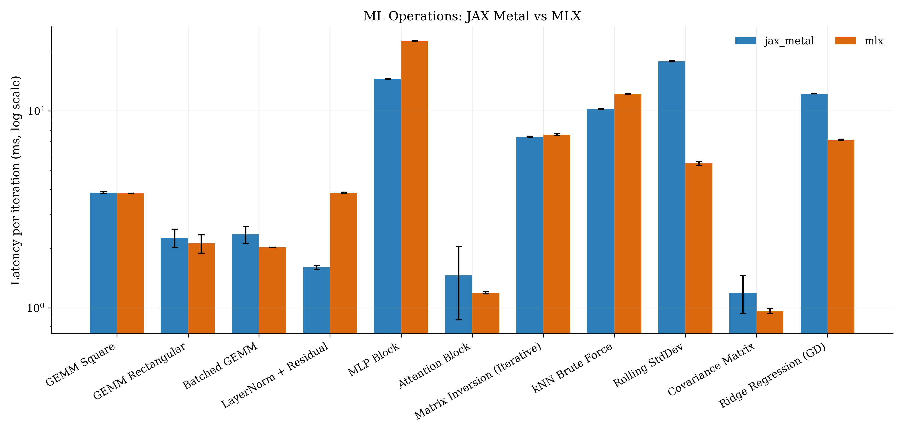
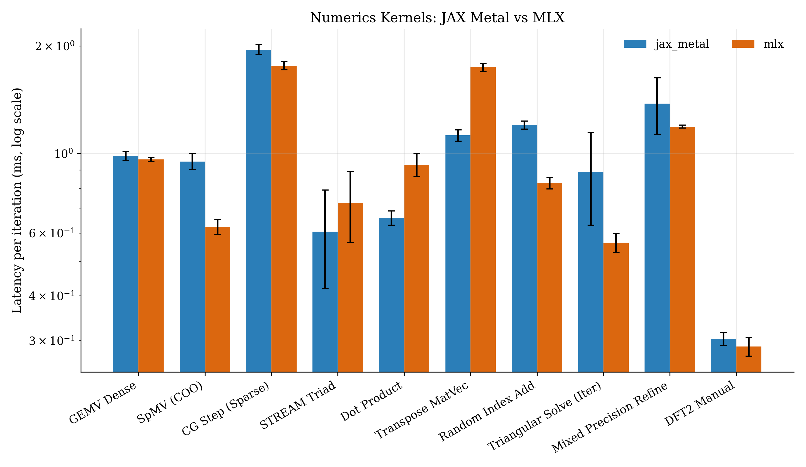

I was interested in a numerics heavy project and wanted to run it on a GPU but using my Macbook (an M2 Pro), so I could run everything locally.
Since Numba was out of the picture, I decided to try the next best options: Jax and MLX. Jax supports Metal through Jax-Metal, and is built to run
<WikiLink term="Accelerated Linear Algebra">XLA</WikiLink> specific operations. MLX is a newer library that is built to run on Metal directly.
However, when I looked online, I couldn't find any benchmarks comparing the two, so I decided to benchmark them myself.

The results are shown in the figures below. There are two main sets of results, one for ML and deep learning focused operations, and one for general numerics.

If you want to learn more about what each operation is, see [here](https://github.com/ndalton12/jax-mlx-benchmark/blob/main/OPERATIONS.md).

The main takeaway is that Jax is a bit better if you focus on ML and deep learning operations, but MLX is a bit better if you focus on general numerics. Though,
it's also worth noting that Jax has a much larger community and ecosystem, so it's likely to be more mature and stable; except I have seen reports online
that _Jax-Metal specifically_ is not nearly as stable as Jax itself.

Do take these results with a grain of salt since I only tested on a single machine (my Macbook) and there are many more factors 
to consider (like memory usage and thermal variation). I think it does get the general gist though. I was also pleasantly surprised to see that
both frameworks performed similarly on a lot of the tasks.

I used MLX version 0.31.0 and Jax version 0.4.34 with Jax-Metal version 0.1.1. The code is available [here](https://github.com/ndalton12/jax-mlx-benchmark)
with a `uv lock` file if you want to reproduce the results yourself. Note that your results may vary depending on your hardware and software versions,
 and that there is some run to run variance, even with a high number of runs and warmup (1000 and 500 respectively).